# Architecture

## 1 — What the extension does

A single prompt surface: the model keeps calling the built-in `edit` tool by name. Behind that name the extension
interposes a pipeline that makes the call more likely to land without changing the contract the model was trained on.

At a high level the call is:

1. **validated and repaired before it runs** — malformed arguments are fixed (`src/repair/*`, wired via
   `prepareEditArguments` in `src/repair/entry.ts`) or rejected with a teaches-the-contract retry message,
2. **checked against file reality before touching disk** — path normalization (`src/guards/preflight/*`),
   staleness gate (`src/guards/stale-read/registry.ts`), first-overwrite nudge for `write`
   (`src/guards/overwrite/guard.ts`), outside-cwd advisory (`src/guards/workspace/advisory.ts`),
3. **matched flexibly against file content** — autopatch fixes (`src/edit/patching/autopatch/*`), an ordered chain
   of 14 tolerant matchers (`src/edit/matching/passes.ts` → `REPLACER_CHAIN`, executed by `findMatch` in
   `src/edit/matching/chain.ts`), an optional anchor window, and disambiguation
   (uniqueness / auto-expand / closest-candidate) in `src/edit/pipeline/resolve.ts`,
4. **applied safely to disk** — encoding-aware, BOM-preserving, byte-preserving (raw-splice), atomic tmp+rename
   (`src/edit/pipeline/execute.ts` + `src/edit/patching/raw-splice.ts`),
5. **observed and bounded after the fact** — advisory warnings (corruption / coherence / semantic),
   undo snapshot (`src/history/store.ts`), failure-loop breaking (`src/resilience/*`), telemetry envelopes
   (`src/telemetry.ts`).

Two other surfaces ride alongside `edit`: an `undo` tool (single-level per-file revert,
`src/platform/tools/undo.ts`) and the `/edit-guard` status command plus the
`/edit-guard:config` settings command (`src/platform/commands/edit-guard/index.ts`). Everything else is hooks and shared plumbing.

## 2 — How an `edit` call flows

```mermaid
flowchart TD
    A["Model calls edit(path, edits[])"] --> B["tool_call hooks"]
    B --> B1["preflight: normalize path in place<br/>or block with did-you-mean"]
    B --> B2["stale-read: block if mtime > last read<br/>(+ tolerance, escalation ladder)"]
    B1 --> C["prepareArguments<br/>repair/entry.ts"]
    B2 --> C
    C --> C1["envelope recovery<br/>decode / escape / unwrap / complete"]
    C1 --> C2["preprocessors ×8<br/>parse, filter, aliases, infer, hoist, fold"]
    C2 --> C3["schema-guided repair ≤3 passes<br/>strict Check-then-repair at issue sites"]
    C3 --> C4["Convert/Check final validate<br/>park notes in RepairLifecycle"]
    C4 --> D["execute() platform/tools/edit.ts<br/>inside withFileMutationQueue(resolvedPath)"]
    D --> D1["validate non-empty edits<br/>correlate repair notes<br/>resolveToCwd + outside-cwd advisory<br/>telemetry.beginEdit"]
    D1 --> E["executeFile() pipeline/execute.ts"]
    E --> E1["read raw bytes → detect encoding<br/>BOM strip → LF-normalize"]
    E1 --> E2["blocks.ts → autopatch ×3<br/>control-chars / trailing-ws / indent"]
    E2 --> F["resolveBlocks() pipeline/resolve.ts"]
    F --> F1["Pass 1: all blocks vs original content"]
    F1 --> F2["Pass 2 (only if some resolved + some<br/>not-found/anchor-not-found):<br/>missing blocks vs post-Pass1 content"]
    F2 --> G["per block: validate → anchor window<br/>→ 14-pass chain → already-applied<br/>→ disproportionate guard<br/>→ replaceAll | uniqueness | auto-expand<br/>→ closest-candidate on failure"]
    G --> H["applyEdits() bottom-up<br/>overlap / no-op / invariant classification"]
    H --> I["raw-splice onto original bytes<br/>BOM restore → atomic tmp+rename<br/>post-write re-read check"]
    I --> J["corruption / coherence / semantic advisories<br/>selfRefresh stale registry<br/>telemetry edit.applied / edit.partial"]
    J --> K["tool layer: saveUndo if changed<br/>native-parity result + details.guard<br/>telemetry.endEdit (exactly once)"]
    K --> L["tool_result / tool_execution_end hooks"]
    L --> L1["stale-read: record read<br/>self-heal own edit/write/undo"]
    L --> L2["stormbreaker: enhance errors<br/>loop-break at threshold → ctx.abort()"]
```



Every step reads `getConfig()` dynamically, so toggling a flag in the settings modal takes effect without a reload.

### 2.1 Wiring (`src/extension.ts`)

No domain logic. Order: `telemetry.setFlushHandler()` (batch → `pi.appendEntry("edit-guard:event")` per
checkpoint, only when `telemetryEnabled`) → `registerStormBreaker()` → `registerStaleReadObserver()` (returns the
registry injected into the edit tool) → `registerPreflight()` → `registerOverwriteGuard()` → `registerEditTool(pi,
{ registry })` → `registerUndoTool()` → `registerEditGuardCommand()`. Lifecycle: `session_start` refreshes config
and flushes pre-session telemetry; `input` / `agent_settled` / `agent_end` / `session_before_tree` /
`session_before_fork` / `session_before_compact` flush as pure observers (return `undefined` — owning a decision
there would hijack turn/branch/compaction handling); `session_shutdown` flushes and clears the repair lifecycle.
The undo store deliberately survives sessions (FIFO-evicted instead); stormbreaker windows are not cleared.

### 2.2 Tool layer (`src/platform/tools/edit.ts`)

Keeps native schema descriptions verbatim (models are trained on them) plus `anchor` and `replaceAll`.
`prepareArguments` delegates to `prepareEditArguments`. `execute` preserves AbortSignal-after-await discipline (checks
`signal.aborted` after each await; no listener-based rejection that would release the file lock early), rejects empty
`edits[]` with the native message, correlates repair notes via `repairLifecycle.correlate("edit", params,
toolCallId)`, resolves `resolveToCwd(path, ctx.cwd)`, emits the outside-cwd advisory itself (so preflight does not
double-count — see `ADVISORY_OWNING_TOOLS`), brackets the call with `telemetry.beginEdit(path, 0)` /
`telemetry.endEdit(...)` (exactly once across success / failure / abort via `finally`), serializes disk work with
pi's `withFileMutationQueue(resolvedPath)`, builds native-shape `details` (`diff`, `patch`, `firstChangedLine`) via
pi's `generateDiffString` / `generateUnifiedPatch`, and appends the additive `details.guard` block
(`passNames`, `repaired`, `diagnostics`, `anchorUsed`, `durationMs`, warning arrays, partial counts). Failures throw
(native convention) with enriched text (closest candidate, alternatives, line positions) plus `<repair_note>` blocks
and the advisory; success text is `Successfully replaced N block(s) in …` (or a `[PARTIAL APPLY]` block), followed by
applied/failed/skipped counts and a `[WARNINGS]` section (coherence, corruption, post-write, semantic, stale
advisory, noop diagnostics; UI notify gated by `warningsEnabled`). Undo capture (`saveUndo`, gated by `undoEnabled`,
only when content changed) failures throw `[E_UNDO_UNAVAILABLE]`.

## 3 — Argument repair (`src/repair/*`)

Entry `prepareEditArguments(input)` (`entry.ts`): when `repairEnabled` is off, only the native-compatibility subset
runs (parse stringified `edits`, drop empty entries, flat-fold) so argument compatibility never regresses. Otherwise
it runs `runRepairPipeline` (`pipeline.ts`) with `EDIT_SCHEMA` (verbatim `path` / `edits[].oldText|newText` +
optional `anchor` / `replaceAll`), the 8 edit preprocessors, the shared `EDIT_FIELD_ALIASES` table, and the
configured policy. `repairLifecycle` (`lifecycle.ts`) parks notes keyed by stable-serialized repaired args
(`prepareArguments` has no `toolCallId`); `execute` correlates by `(toolName, args)` and `take`s by `toolCallId`.
Misses are harmless (notes lost, never mis-attached). Every mutation emits `repair.rule` telemetry; unrepairable
failures carry an FNV-1a fingerprint of the failure shape for per-model regression tracking.

### 3.1 Stages

1. **Envelope recovery** (`envelope.ts`) — decode JSON-stringified arguments within budget (256 KB, depth 64,
   3 attempts, 25 ms), escape raw control characters inside strings, unwrap singleton object arrays;
   truncated-envelope completion candidates are tried first when the policy allows.
2. **Preprocessors** (`preprocess.ts` driver; edit rules defined in `entry.ts`), in order:
   - `parse-stringified-edits` — JSON string → array, tolerating literal newlines (`fixJsonNewlines`), repairing
     under-escaped quotes guided by `JSON.parse` error positions (≤5 rounds) and punctuation debris (trailing
     commas, short dangling fragments ≤ 18 chars).
   - `filter-empty-edits` — drop `""` entries from `edits[]`.
   - `drop-empty-edit-objects` — drop `{}` placeholders (if all entries were empty, downstream min-items fails
     honestly instead of emitting phantom property noise).
   - alias renames — `path` (`absolutePath`, `file_path`, `filePath`, `filepath`, `pathname`, `target_file`,
     `targetFile`, `file`, `absolute_path`), `oldText` (`old_string`, `oldString`, `old`, `old_str`, `oldStr`,
     `from`, `old_value`, `old_text`, `oldContent`, `old_content`), `newText` (mirror set + `to`), plus nested
     per-edit `path` aliases. Single source: `EDIT_FIELD_ALIASES` in `aliases.ts`.
   - `infer-deletion-missing-newtext` — edit with only `oldText` becomes a deletion (`newText: ""`).
   - `infer-insertion-missing-oldtext` — edit with only `newText` + an `anchor` contained verbatim in `newText`
     becomes `{ oldText: anchor, newText }` (an insertion after the anchor).
   - `hoist-nested-path` — when every edit carries the same inner `path` and no root path exists, it is hoisted;
     disagreeing paths stay invalid with a split-the-call hint.
   - `flat-fold` — top-level `oldText`/`newText` (camelCase + snake_case, optional `anchor`/`replaceAll`) appended
     as one new `edits` entry (mirrors native fold semantics).
3. **Schema-guided repair** (`repair-engine.ts`) — strict TypeBox `Value.Check` runs _before_ `Convert`
   (`Convert` silently corrupts exactly the inputs this layer fixes: `'["a"]'` → `['["a"]']`,
   `null` → `"null"`). On failure, up to three passes over the validator's issue sites apply rules in fixed order:
   rename aliased field → drop null/undefined field → drop empty-object placeholder → parse JSON-stringified
   array → parse JSON-stringified object → wrap bare string as single-element array. A pass stops early when nothing
   fires; re-collection exposes nested issues after structural repairs. Markdown auto-links in path fields are
   unwrapped before the strict check; a root-string input is handled as well.
4. **Final validation** through `Convert`/`Check` so benign coercions (`"5"` → `5`) survive. Unrepairable input
   throws a model-facing retry message (schema issues + received-input preview) enriched by
   `describeUnrepairableEditInput()` hints for known dead ends: double-encoded `edits` string (parseable-but-wrong
   shape vs unparseable), multiple distinct paths inside `edits[]`, and `newText`-without-`oldText` (insert
   guidance). `preprocess.ts` interprets selectors (`/`, `/edits/*/oldText`, `*` wildcard) with alias, structural,
   and typed kinds (model-gated heuristics degrade to observations per policy).

### 3.2 Policy profiles (`policy.ts`, default `adaptive`)

| Profile        | Truncated-envelope completion | Valid-value transforms | Grammar mode |
| -------------- | ----------------------------- | ---------------------- | ------------ |
| `conservative` | off                           | off                    | observe      |
| `adaptive`     | on                            | on                     | strip        |
| `recover`      | on                            | on                     | recover      |

`unknownGrammarText` is `preserve` in all three profiles today.

## 4 — Matching engine (`src/edit/matching/*` + `src/edit/pipeline/resolve.ts`)

### 4.1 Chain executor (`chain.ts`)

`findMatch(original, oldContent, { allowSearchOnly = true })` LF-normalizes both inputs (port of OpenDev's
`find_match()`), then walks `REPLACER_CHAIN` first-hit-wins. Each pass returns verbatim file text or null; the
winner's `actual` + `passName` become the `MatchResult`. No occurrence counting here — uniqueness is the caller's
job (`resolve.ts`). `allowSearchOnly: false` excludes heuristic passes (`fuzzy_boundary`, `token_overlap`); anchor
lookups always use it, because a fuzz-found anchor could silently re-anchor an edit to a wrong-but-similar region
and defeat the redundant-anchor guard. `findOccurrencePositions()` lists 1-indexed line numbers of every occurrence
of a needle.

### 4.2 The 14 passes (`passes.ts`) — definition order ≠ execution order

`REPLACER_CHAIN` at the bottom of `passes.ts` is the sole authority. Ordering principle: a pass may shadow another
only when its match is a _more precise_ reading of the model's intent — deterministic transforms (tier 3) precede
anchored-fuzzy passes (tier 4), which precede loose legacy scans (tier 5); uniqueness-gated reinforcement passes
stay last.

| #   | Pass (`passName`)                                               | Tier                          | What it does                                                                                                                                                                                                                                                                                                                                                                                                                                               | Key thresholds / gates                                                                                                                                 |
| --- | --------------------------------------------------------------- | ----------------------------- | ---------------------------------------------------------------------------------------------------------------------------------------------------------------------------------------------------------------------------------------------------------------------------------------------------------------------------------------------------------------------------------------------------------------------------------------------------------- | ------------------------------------------------------------------------------------------------------------------------------------------------------ |
| 1   | `simple` (`simpleFind`)                                         | 1 — verbatim                  | `original.includes(oldText)`                                                                                                                                                                                                                                                                                                                                                                                                                               | —                                                                                                                                                      |
| 2   | `line_trimmed` (`lineTrimmedFind`)                              | 2 — per-line trim             | compares trimmed lines; strips blank-line frames from the query so a leading/trailing empty line can't anchor on a blank (absorbs the former `multi_occurrence` pass); interior blanks still matched trimmed                                                                                                                                                                                                                                               | all-blank query → null                                                                                                                                 |
| 3   | `whitespace_normalized` (`whitespaceNormalizedFind`)            | 3 — exact-after-normalization | collapses whitespace runs per line (`\s+` → single space + trim) then compares; scans windows of `oldLineCount-1 … oldLineCount+2` lines                                                                                                                                                                                                                                                                                                                   | deterministic: fires only on essentially-exact-after-rewrite content                                                                                   |
| 4   | `indentation_flexible` (`indentationFlexibleFind`)              | 3                             | ignores leading indentation and blank lines, compares trimmed lines sequentially within a `3×` search window                                                                                                                                                                                                                                                                                                                                               | skips blank file lines while scanning                                                                                                                  |
| 5   | `escape_normalized` (`escapeNormalizedFind`)                    | 3                             | unescapes `\\`, `\n`, `\t`, `\r`, `\"`, `\'`, `` \` ``, `\$` then retries verbatim                                                                                                                                                                                                                                                                                                                                                                         | fires only when unescaping changes the query                                                                                                           |
| 6   | `unicode_normalized` (`unicodeNormalizedFind`)                  | 3                             | NFKC + punctuation map (curly quotes → ASCII, en/em dash → `-`); NFKC covers NBSP/ligatures, the map covers what NFKC doesn't; maps the normalized hit back to verbatim bytes via `mapNormalizedIndex`                                                                                                                                                                                                                                                     | skipped when query already normalized _and_ file is pure ASCII                                                                                         |
| 7   | `block_anchor` (`blockAnchorFind`)                              | 4 — anchored fuzzy            | first/last trimmed lines must match exactly; middle scored by LCS `similarity`; window ≤ `2×` query lines; boundary pairs enumerated before any DP and refused when `pairs × middleChars²` exceeds `BLOCK_ANCHOR_BUDGET_CELLS` (100M) — over-budget shapes return null fast so the cheaper Levenshtein twin below can rescue them instead of grinding                                                                                                      | needs ≥3 lines; threshold 0.3 single candidate / 0.5 multiple                                                                                          |
| 8   | `block_anchor_levenshtein` (`blockAnchorLevenshteinFind`)       | 4                             | same anchors; middle scored by per-line raw-Levenshtein mean (equal-length middles only) — deliberately _raw_: a single proven line must not carry a weak window over the gate                                                                                                                                                                                                                                                                             | needs ≥3 lines; 0.3 / 0.5 thresholds                                                                                                                   |
| 9   | `fuzzy_boundary` (`fuzzyBoundaryFind`, `searchOnly`)            | 4                             | whole-block similarity with _fuzzy_ boundaries: fixed window = query line count, mean per-line Levenshtein ≥ **0.9**, at least one boundary line ≥ **0.75**, exactly one qualifying window in the file; provable pairs (exact-after-trim or single substitution on lines ≥ 8 chars, i.e. implied similarity ≥ 0.875) score 1.0 for the _anchor prefilter only_ — the mean keeps raw scores; length-ratio floor shortcut + early-abandon keep it O(bounded) | ≥3 lines; `FUZZY_BOUNDARY_SIM = 0.9`, `FUZZY_BOUNDARY_ANCHOR = 0.75`, `PROVABLE_SUBSTITUTION_MIN_LEN = 8`; non-unique → null                           |
| 10  | `trimmed_boundary` (`trimmedBoundaryFind`)                      | 5 — loose legacy              | whole-block trim retry, then first/last-line contains-anchors with `+2`-line slop                                                                                                                                                                                                                                                                                                                                                                          | fires only when trimming changes the query                                                                                                             |
| 11  | `context_aware` (`contextAwareFind`)                            | 5                             | first/last non-empty lines as contains-anchors, best window by LCS similarity; length-ratio bound prune before the DP                                                                                                                                                                                                                                                                                                                                      | needs ≥2 lines; similarity > 0.5; first end-anchor per start only                                                                                      |
| 12  | `robust_trimmed` (`robustTrimmedFind` in `robust-match.ts`)     | 6 — reinforcement             | pi-robust-edit port: match against per-line `trimEnd()`ed file, then walk the original buffer to extract _verbatim_ bytes (trailing whitespace absorbed); uniqueness-gated in both trimmed and original space                                                                                                                                                                                                                                              | returns null when trimming changed nothing or either space is ambiguous                                                                                |
| 13  | `robust_backslash` (`robustBackslashFind` in `robust-match.ts`) | 6                             | bidirectional JSON-escape normalization: add `\` before bare `"` / strip `\` before `"`; each variant must match exactly once                                                                                                                                                                                                                                                                                                                              | uniqueness-gated per variant                                                                                                                           |
| 14  | `token_overlap` (`tokenOverlapFind`, `searchOnly`)              | 7 — token-multiset rescue     | for content that survives but line order doesn't: sliding windows of `M-2 … M+2` lines over incrementally-maintained token multisets (identifiers/numbers/punctuation), Sørensen-Dice ≥ **0.65** then LCS/Levenshtein-family floor ≥ **0.45**; best-Dice window wins, but a second _non-overlapping_ qualifier anywhere is ambiguity → null (overlapping qualifiers are the same region at neighbor sizes)                                                 | `TOKEN_MIN_LINES = 3`, `TOKEN_DICE_MIN = 0.65`, `TOKEN_LEV_FLOOR = 0.45`; 400k window-evaluation budget guard; runs dead last, never in anchor lookups |

Every pass returns text verified with `original.includes(actual)` — matched text is always verbatim file content,
so replacements preserve real formatting.

### 4.3 Similarity primitives (`similarity.ts`)

LCS ratio `similarity(a, b) = 2·LCS/(lenA+lenB)` over UTF-16 code units (mirrors OpenDev's `passes.rs`,
space-optimized DP); `similarityUpperBound = 2·min/(lenA+lenB)` is the O(1) exact prune — rejecting via the bound
never changes outcomes. Token layer: `tokenCounts` (identifiers, numbers, single punctuation), `intersectSize`,
`tokenDice` (Sørensen-Dice), `tokenJaccard` — order-insensitive complements used by `token_overlap` and by
closest-candidate diagnostics. `verifiedLineSim` (`passes.ts`) adds the provable fast tier (exact-after-trim or
long-line single substitution → 1.0, monotone over raw Levenshtein) ahead of the DP.

### 4.4 Per-block resolution (`resolve.ts`: `resolveBlocks` → `doResolvePass`)

`resolveBlocks(content, blocks, path)` is the two-pass entry point: **Pass 1** resolves every block against the
_original_ normalized content (non-incremental — all blocks see the same snapshot, so earlier edits can't silently
shift later matches) and collects _all_ errors (no short-circuit). **Pass 2** fires only when some blocks resolved
while others failed as `not-found` / `anchor-not-found`: the missing blocks re-resolve against the post-Pass1
application content (shift-induced misses, e.g. line numbers drifted because Pass 1 inserted lines); diagnostics and
errors remap to original block indices (`edits[N]` text rewritten), and Pass 2 offsets apply sequentially after
Pass 1. Do not make Pass 1 incremental — that re-introduces the overlapping-shift misfire class.

Per block in a pass (`doResolvePass`):

1. **Validation** — empty `oldText` fails as validation; `oldText === newText` after newline normalization fails as
   noop.
2. **Anchor window** — one `findMatch(..., { allowSearchOnly: false })` probe serves both paths. A _redundant_
   anchor (matches nowhere but similarity to trimmed `oldText` ≥ **0.9**) is dropped entirely (telemetry
   `anchor.redundant_dropped`) and matching falls back to full content. Otherwise: ambiguous anchor fails
   immediately (`anchor.ambiguous` + alternatives); found anchor scopes `oldText` search to the anchor line span
   ± `MAX_EXPAND_LINES` (**10**); missing anchor tries near-miss fallback anchors with similarity > **0.7** before
   failing with a closest-candidate report — and if the anchor exists only in the model's imagination while `oldText`
   itself matches verbatim-unique, resolution degrades to unanchored matching (`anchor_not_found_full_retry`) instead
   of wasting a correct edit. If windowed search fails but the anchor scoped it, resolution retries unanchored at
   full scope (`anchor_window_overflow_fallback` when `oldText` starts with the anchor, else
   `anchor_window_miss_full_retry`); unique-at-full-scope applies, ambiguous-at-full-scope reports honestly.
   Window-relative candidate lines remap to absolute lines for diagnostics.
3. **Chain** — `findMatch()` short-circuits on first hit (see §5.2).
4. **Already-applied detection** — no match but normalized `newText` present verbatim: requires length ≥
   `ALREADY_APPLIED_MIN_CHARS` (**16**) _and_ (unique occurrence _or_ length ≥ **64**) so a short boilerplate line
   can't false-positive; reports `already-applied` with the `newText` line positions as falsifiable evidence
   (same guard mirrored in `apply.ts` for fuzzy spans equal to the replacement, gated on non-`simple` passes and
   substantial spans).
5. **Disproportionate guard** — refuse fuzzy matches spanning far more than the query (wrong-edit near-miss):
   matched span ≥ `max(oldLines + 3, oldLines × 2)` lines (applies even to single-line queries), or for multi-line
   queries trimmed length > `max(query + 500, query × 4)`.
6. **replaceAll** — every span of the matched text is replaced (pass name `replace_all` when multiple spans);
   uniqueness/auto-expand skipped; each span individually disproportionate-checked.
7. **Uniqueness** — occurrences of the actual matched text counted within the search scope
   (`reportOccurrences` in `uniqueness.ts`); more than one is ambiguous (alternatives via
   `buildAmbiguousAlternatives` in `candidates.ts`).
8. **Auto-expand** — context grows symmetrically around each occurrence, alternating above/below up to 10 added
   lines (5 per side). Exactly one unique candidate wins (pass name `auto_expand`); multiple simultaneously-unique
   candidates bail as ambiguous (a unique block stays unique under extension, so further growth can't help).
9. **Closest candidate** — no pass matched: `findClosestCandidate` returns the nearest near-miss _regardless of
   threshold_ (see §5.5), reported with line range and similarity percentage.

### 4.5 Closest candidate (`closest.ts`) and candidates (`candidates.ts`)

`findClosestCandidate(original, oldContent, maxCandidates = 50)`: anchors on lines ≥ **0.3** similar to the query's
first line (length-ratio pre-prune), scores bounded windows (`M-1 … 2M` lines) with DPs in _descending bound order_
so the first DP fixes a strong best and everything that can't strictly beat it is skipped; a **50M-cell DP budget**
caps pathological files (diagnostics degrade gracefully instead of hanging). Returns the best window with
`tokenDice`/`tokenJaccard` diagnostics. `candidates.ts` supplies `findAllExactSpans`, budgeted near-miss ranking
(`buildNearMissAlternatives`), and ambiguous-alternative previews for error messages.

### 4.6 Apply (`apply.ts`)

`applyEdits(content, resolved)`: detects overlapping spans on the _original_ coordinate space first (both
participants fail explicitly — overlaps are never guessed), sorts bottom-up (descending start, wider span first,
oldText tiebreak) so indices stay valid while splicing, and classifies failures as `overlap` / `already-handled`
(span collision), `no-op` (including the already-applied fuzzy variant), or `invariant` (span no longer at the
expected offset — verified via `result.slice(start, end) === match.actual` before each splice).

## 5 — Autopatch (`src/edit/patching/autopatch/*`)

`autopatchBlocks(blocks, normContent)` mutates blocks in place _before_ resolution. Safety gates per pass: original
text has 0 matches, corrected candidate exactly 1 (Pass 2 additionally requires an indentation-only change):

- **Pass 0 — escaped control characters** (`index.ts`): literal `\t`/`\n` (JSON-decoded two-char escapes the model
  emitted as control chars) re-escaped to `"\\t"`/`"\\n"`.
- **Pass 1 — trailing whitespace** (`trailing-ws.ts` → `computeTrailingWhitespaceOldTextPatch`): per-line trailing
  whitespace and trailing empty lines stripped/aligned in `oldText` (and `newText` when the patch carries one).
- **Pass 2 — indentation mismatch** (`indent.ts` → `tryCorrectIndentationMismatchFromContent`, gated by
  `isIndentationOnlyChange`): tab↔2/4-space conversions plus indentation-insensitive scan;
  `indent-retarget.ts` → `retargetReplacementIndentation` maps `newText` leading whitespace to match the correction.

Each firing emits `edit.autopatch`. Gates that fail fall through silently — the resolver reports the original text.

## 6 — Execute pipeline (`src/edit/pipeline/execute.ts` + `raw-splice.ts`)

`executeFile(path, edits, opts)` is pure core with injected fs ops / `mutationQueue` / `selfRefresh` for testability:

1. Resolve path against `cwd` (`resolveToCwd`); empty `edits[]` → validation error.
2. Read raw bytes; detect encoding (UTF-8 BOM → valid-UTF-8 re-encode check → `latin1` fallback); decode.
3. Strip BOM before matching (re-prepended on write); LF-normalize for the match space
   (`normalizeLineEndings`); keep original raw content for reconstruction.
4. `patchEditsToBlocks` → `autopatchBlocks` (3 passes) → `resolveBlocks` (two-pass, §5.4).
5. Apply: Pass 1 offsets (original space) via `applyEdits`, then Pass 2 edits (post-Pass1 space) via `applyEdits`
   sequentially so coordinates stay valid; resolve-stage and apply-stage failures merge back onto original block
   indices (structural `EditError.index` — never message-regex extraction).
6. Raw-splice reconstruction: `buildPassSplices()` converts each pass's applied edits into sorted `RawSplice[]`;
   `spliceOntoRaw(bomStripped, pass1Splices)` then `spliceOntoRaw(afterPass1Raw, pass2Splices)` rebuild the file on
   original bytes. `buildNormToRawMap` walks raw vs normalized in lockstep (O(n)), correctly distinguishing folded
   CRLF pairs from lone-`\r` folds; untouched regions keep exact bytes (mixed endings survive).
7. Restore BOM; atomic write: `.edit-guard-{timestamp}-{random}.tmp` in the target directory (parent mkdir
   recursive, best-effort), `rename` over the target; temp unlinked (not truncated) on failure.
8. Post-write re-read verification: byte equality against what was written (bytes, not decoded text — decoding
   would false-positive on `latin1` truncation); mismatch yields a `[CORRUPTION CHECK]` warning, never an error.
9. `selfRefresh(path)` (raw user path — the key the hook checks) so the agent's own write never self-blocks.
10. Advisories: `detectDuplicatedBlocks` (insertions ≥ 120 chars; consecutive-sequence duplication gated by
    expansion ratios ≥ 3.5×–6× plus internal-duplicate + density gates; context before/after duplication with
    5-line / 70% gates; prefix echo with 24-char / 3× / 8% gates; cascading duplicates), `coherenceCheck`
    (`focusLines` ±6, gated by `coherenceCheckEnabled`, default off — see §9), semantic warnings for
    `token_overlap` placements (always on — drift risk, verify placement), confusable-glyph warnings for
    curated lookalike classes NFKC does not fold (always on — names both codepoints, see §8).
11. Telemetry `edit.applied` always (+ `edit.partial` on partial applies); success `details` carry `baseContent` /
    `newContent` (LF-normalized pre/post), `rawContent` / `rawResult` (BOM-stripped raw pre/post), `bom`,
    `originalEnding`, `encoding`, `editsApplied` (sorted block-index _list_), `passNames`, `durationMs`, warnings,
    and `diagnostics`.

**Partial apply:** when some edits succeed and others fail, the successful subset is written; the message is
`Applied X of N edits…` with per-failure `edits[i]` reasons and up to two alternatives each (ambiguous failures get
`formatAmbiguousReason` guidance: occurrence lines + how to disambiguate). Total success, total failure (first
error + compact alternatives), and partial success are three distinct result shapes.

## 7 — Hooks (`src/platform/hooks/*` + `src/guards/*`)

### 7.1 Path preflight (`preflight.ts` → `guards/preflight/*`)

Listens on `tool_call` for exactly six tools: `read`, `edit`, `write`, `ls`, `grep`, `find` (`ls`/`grep`/`find`
treat the path as optional and pass through when absent). Extracts the first path argument (`path`, then
`file_path`), trims whitespace, strips surrounding quotes, resolves against cwd, renames alias keys, and mutates
`event.input[key]` **in place** (pi discards a returned `{input}` object — mutation is the only effect, not a
returned replacement). Outcomes:
_pass_ (already normalized and, for read-like tools, exists), _normalized_ (mutated), _block_ (missing path: up to
three Levenshtein suggestions from directory entries, threshold proportional to basename length, tighter for tiny
names, else a generic ls/find hint; telemetry `preflight.normalized` / `preflight.blocked`). For `write`, existence
is skipped and the parent directory is created recursively (creation failure blocks). Outside-cwd advisories for
read-style tools live here; `edit`'s advisory is emitted by the tool itself (`ADVISORY_OWNING_TOOLS` prevents double
counting).

### 7.2 Stale-read protection (`stale-read.ts` → `guards/stale-read/registry.ts`)

Pure `ReadRegistry` (injected `stat`/`readFile`/`now`/`baseDir`, keyed by `resolve(baseDir, path)`): successful
`read` result → `record(path)`; successful `edit`/`write`/`undo` result → `selfRefresh(path)` (plus the executor's
own post-write `selfRefresh`, so `read → write → edit` never self-blocks); `edit` `tool_call` →
`assertFresh(path, { oldTexts })` with a per-`mtime` ladder — same drift → advisory, new drift → error — except
_verbatim-safe_ edits (every `oldText` still present in current content, CRLF-normalized) downgrade to advisory on
first contact. The result-text advisory itself is gated the same way: `getStaleWarning(path, oldTexts)` stays
silent when the splice is provably applicable (formatter drift elsewhere is not this edit's problem) and warns only
when drift plausibly affects the search texts. Freshness compares `mtimeMs` against `max(lastRead, lastEdit) + tolerance` (default 500 ms,
`staleReadToleranceMs`); `warned`/`driftMtime` reset on every fresh `record`/`selfRefresh`. Telemetry:
`stale_read.blocked` / `stale_read.self_healed`.

### 7.3 Overwrite guard (`overwrite.ts` → `guards/overwrite/guard.ts`)

**Disabled by default** (`overwriteGuardEnabled: false`). Per-session `Set<string>` of nudged paths. The first
`write` per file per session to an existing _non-empty_ file is blocked with a one-line-count nudge suggesting
`edit`; the second call for the same path passes unconditionally. New files and empty-file overwrites always
pass. State resets on `session_shutdown`. Intended use case: small local models that silently drop code by
overwriting entire files from a stale in-memory view — enabling this guard forces them toward `edit` for
targeted changes. Telemetry: `overwrite_guard.blocked`.

### 7.4 Stormbreaker (`stormbreaker.ts` → `resilience/*`)

Two handlers, config read dynamically: **error enhancement** (`tool_result`) pattern-matches error text and appends
actionable suffixes (no-such-file with an empty-path special case, permission denied, edit exact-string-not-found
with stale-read/whitespace hints, offset beyond end of file; everything unmatched gets a `[toolName]` prefix;
telemetry `stormbreaker.enhanced`) and **loop breaking** (`tool_execution_end`, pure state in
`resilience/stormbreaker.ts`): failures land in a per-tool sliding window (last 10), each normalized into a
signature (paths → `<path>`, line numbers → `line N`, ISO timestamps → `<timestamp>`, hex → `<hex>`, capped at 200
chars; interleaved A,B,A,B,A patterns count). Any single signature reaching the threshold (default 3, clamped
1–10) breaks the loop: `ctx.abort()`, a user-visible message plus an `edit-guard:stormbreaker` session entry
(`triggerTurn: false`), a UI warning notification, and a scheduled follow-up retry prompt
(`buildRetryGuidance` in `platform/hooks/stormbreaker.ts`) after `stormbreakerRetryDelayMs`
(3 s default, 1–10 s, `unref`-ed timer). `buildRetryGuidance` emits tool-specific corrective steps: for
`edit` — re-read the target region, copy oldText verbatim from the fresh read, use an anchored edit when
oldText is not unique, keep oldText minimal-but-unique and merge nearby changes; for `bash` — re-think the
command, inspect current state before rerunning, isolate the failure with the smallest command; other tools
get generic verify-arguments guidance. Every retry prompt ends with "if the same failure repeats, stop and
explain the blocker instead of looping". Aborted operations are excluded from the window; any success clears the
tool's entire window. Counters: `loopsBroken` / `errorsEnhanced`.

## 8 — Warnings — advisory, never blocking (`advisories/coherence.ts`, `execute.ts`)

- **Corruption** (`detectDuplicatedBlocks` in `execute.ts`): see §7 step 10. Tuned 2026-09 against wild false
  positives (header-line retention, single-line expansions) — expansion-ratio + consecutive-sequence +
  internal-duplicate + density gates must _all_ agree.
- **Coherence** (`coherence.ts`, gated by `coherenceCheckEnabled`, **default off**): indentation-jump warnings
  (> 8 spaces between lines at the same brace depth, within ±6 lines of edited `focusLines`, skipping
  string-literal lines). Brace/paren/bracket balance analysis exists but is disabled
  (`BRACE_BALANCE_ENABLED = false`) pending false-positive tuning.
- **Semantic** (`buildSemanticWarnings` in `execute.ts`, always on): `token_overlap` placements name their line
  range and ask the agent to re-read and verify — the text did not match exactly.
- **Confusable** (`buildConfusableWarnings` in `execute.ts`, always on): curated lookalike classes NFKC does
  not fold (currently U+EE9C / U+2E9C / U+2301 — extend with observed pairs only). Two checks per applied
  edit: search-side (`oldText` carries a class member the matched span lacks while the span carries another —
  the match bridged a lookalike gap) and insert-side (`newText` introduces a class member absent from the
  pre-edit file while the file uses a lookalike — catches pure insertions). Both name both codepoints and
  nudge toward `\u{...}` escapes. Verbatim matches can never fire. Class members in source MUST stay as
  `\u` escapes — a literal invisible glyph is unreviewable and one clipboard round-trip away from becoming
  the corruption this check detects.

## 9 — Undo store (`platform/tools/undo.ts` + `history/store.ts`)

Gated by `undoEnabled`. Append-only JSONL dump (`pi-better-toolcalls-undo-store.jsonl`) — one `{ path, record }`
line per put, `null`-record tombstones for deletes; last line per path wins. Single `O_APPEND` writes with looped
`writeSync` (short-write safe) keep concurrent sessions from interleaving partial lines; reads are stateless
(dump re-read per operation); malformed/torn lines skipped. Location: `PI_UNDO_STORE_PATH` env, else
`<pi-agent-dir>/…`, else `~/.local/state/pi-better-toolcalls/undo-store.jsonl`. Bounds: FIFO eviction at
`undoMaxBytes` (default 5 MB, clamped 64 KB–50 MB); oldest-`updatedAt` dropped first, newest always kept. Records
survive sessions by design. `saveUndo()` stores LF-normalized + raw pre-edit content, BOM, line ending, encoding,
session id, project cwd, timestamp — only when content actually changed; persistence failure →
`[E_UNDO_UNAVAILABLE]`. Undo flow: file missing or bytes differing from the stored post-edit snapshot clears the
entry and reports `[E_UNDO_STALE]` with snapshot age/provenance; otherwise the pre-edit state is written back
(under `withFileMutationQueue`) and the entry cleared.

## 10 — Telemetry and envelopes (`telemetry.ts`)

Pure `EditGuardTelemetry` singleton with three simultaneous outputs: in-memory counters (→ `/edit-guard`),
bounded ring buffer (last 50, → Audit tab), and a pending batch (→ one `edit-guard:event` entry per checkpoint,
128-event overflow safety). `flushNow()` is idempotent; handler throws retain the batch for the next checkpoint.
`beginEdit(path, 0)` / `endEdit(token)` brackets exactly one envelope per edit call (success / failure / abort —
the tool's `finally` covers the abort case; `clearEditContext` drops calls aborted before execution produced data).
The envelope consolidates path, applied/failed counts, pass names, anchor flag, duration, repair rules fired during
the call, warning arrays, closest candidate, and repair notes into one `edit-guard:envelope` entry. Event kinds:
`repair.rule`, `match.pass`, `match.closest_candidate`, `anchor.not_found`, `anchor.redundant_dropped`,
`anchor.ambiguous`, `match.already_applied`, `preflight.normalized`, `preflight.blocked`, `stale_read.blocked`,
`stale_read.self_healed`, `overwrite_guard.blocked`, `stormbreaker.enhanced`, `stormbreaker.loop_broken`,
`edit.applied`, `edit.partial`, `edit.autopatch`, `edit.envelope`.

## 11 — Configuration (`config/*` + `packages/pi-base`)

`EditGuardConfig` (`settings.ts`, 16 keys: repair, stormbreaker, stale-read, preflight, edit override, telemetry,
status command, undo, overwrite guard, warnings, coherence, outside-cwd advisory) with validated defaults read from
`env.ts` (`EDIT_GUARD_*`, clamped where relevant: e.g. stormbreaker threshold 1–10, undo bytes 64 KB–50 MB) and
layered resolution _defaults ← global file ← project file (`.pi/edit-guard-config.json`) ← env vars_ via
`ConfigManager` (from `@k0valik/pi-base` — used, not reimplemented). Mutations go through `getConfig()` (cached,
refreshed on `session_start` / modal save) and the settings modal declares fields, option labels, and per-field env
bindings. `config.resetScope(scope)` removes known keys, preserves unknown ones, deletes the file when nothing
unknown remains. Filename: `edit-guard-config.json`.

## 12 — Cross-cutting notes

- **Encoding and line endings** flow through one normalized space (LF, BOM-stripped) for matching and a raw space
  for disk; `raw-splice` reunites them under O(n) offset mapping, including lone-`\r` vs `\r\n` disambiguation.
- **Concurrency** is serialized per file via pi's `withFileMutationQueue` around both the edit executor and the
  undo tool; the undo store uses `O_APPEND` under looped `writeSync` so concurrent sessions do not interleave
  partial lines.
- **Partial application** is explicit: `resolveBlocks` collects every error (no early exit) and Pass 2 re-resolves
  not-found blocks against post-Pass1 content; `applyEdits` verifies `result.slice(start, end) === match.actual`
  before splicing and distinguishes already-applied from true no-ops.
- **Shared paths** (`shared/paths.ts`): `resolveToCwd` is a verbatim port of pi's resolution (tilde expansion,
  unicode-space normalization, `@`-prefix stripping, `file://` URLs) — the sole canonicalization for guard and
  executor.
- **Distribution**: `pnpm` only, ESM, `tsup` bundles to `dist/` with pi deps external, no runtime dependencies.

## 13 — History to keep in mind when reading old docs

Any note that claims a `src/core` tree, top-level `src/hooks`/`src/tools`, a 12/13-pass chain, `src/telemetry/` as a
directory, a `write-guard.ts` workspace approval dialog, per-occurrence stale blocking without an escalation ladder,
or stormbreaker auto-resume is outdated. The authoritative tree is §2 and the chain is §5.2 (14 passes, 7 tiers).
For baseline numbers and the measurement loop (pool / score / replay / live-failures), see `README.md`'s repo map
and `docs/baselines/` — those are intact.

## 14 — Current layout

```
src/
  extension.ts              # wiring only — hooks/tools/commands, telemetry flush, lifecycle checkpoints
  index.ts                  # barrel re-exports for tests / external consumers
  telemetry.ts              # EditGuardTelemetry singleton: counters + ring buffer + pending batch + envelopes
  advisories/
    coherence.ts            # post-edit indentation advisories (brace-balance present but disabled)
  config/
    env.ts                  # EDIT_GUARD_* env var parsing + defaults
    settings.ts             # EditGuardConfig type, validation/clamping, getConfig()/refreshConfig()
  edit/
    model.ts                # shared domain types (Edit, ParsedBlock, MatchResult, diagnostics, errors…)
    text.ts                 # BOM + line-ending helpers; ALREADY_APPLIED_MIN_CHARS = 16; LF is the match space
    errors.ts               # pure error builders (stale-read, ambiguous, not-found, already-applied…)
    matching/
      passes.ts             # 14 match functions + REPLACER_CHAIN (sole ordered registry, 7 tiers)
      chain.ts              # findMatch() — walks REPLACER_CHAIN first-hit-wins; findOccurrencePositions()
      closest.ts            # findClosestCandidate() — nearest near-miss on failure, no threshold gate
      candidates.ts         # exact-span enumeration + near-miss ranking + preview building for errors
      robust-match.ts       # reinforcement passes (robust_trimmed, robust_backslash — pi-robust-edit port)
      similarity.ts         # LCS ratio, length-ratio upper bound, token-multiset Dice/Jaccard
    patching/
      raw-splice.ts         # buildNormToRawMap + spliceOntoRaw + line-offset helpers (byte preservation)
      autopatch/
        index.ts            # autopatchBlocks() — runs 3 pre-resolution fixes, mutates blocks in place
        indent.ts           # tryCorrectIndentationMismatchFromContent() + isIndentationOnlyChange()
        indent-retarget.ts  # retargetReplacementIndentation() — re-indents newText after a correction
        trailing-ws.ts      # computeTrailingWhitespaceOldTextPatch()
    pipeline/
      blocks.ts             # patchEditsToBlocks(): PatchEdit[] → ParsedBlock[] adapter
      resolve.ts            # resolveBlocks()/doResolvePass() — anchor, chain, guards, uniqueness, 2-pass retry
      apply.ts              # applyEdits() — overlap detection + bottom-up splice + failure classification
      execute.ts            # executeFile() — per-file end-to-end (read → … → write → advisories)
      uniqueness.ts         # reportOccurrences() / formatLinePositions()
  guards/
    preflight/
      preflight.ts          # path reality check for read/edit/write/ls/grep/find
      paths.ts              # PATH_TOOLS table + path-key extraction + quote stripping
      suggest.ts            # Levenshtein near-match suggestions for missing paths
    stale-read/
      registry.ts           # ReadRegistry — mtime-based staleness, escalation ladder, self-heal
    overwrite/
      guard.ts              # OverwriteGuard — first-write nudge for `write` (per-session Set)
    workspace/
      advisory.ts           # getOutsideCwdAdvisory() — non-blocking outside-cwd notice (owner-aware)
  history/
    store.ts                # JSONL append-only undo dump (FIFO-bounded, session-surviving) + saveUndo()
  platform/
    tools/
      edit.ts               # `edit` override — prepareArguments + execute, native parity
      undo.ts               # `undo` tool — staleness-checked revert from history/store
    hooks/
      preflight.ts          # pi.on("tool_call") → preflight, mutates event.input in place
      stale-read.ts         # pi.on("tool_result"/"tool_call") → record / block / self-heal
      overwrite.ts          # pi.on("tool_call") for `write` → OverwriteGuard
      stormbreaker.ts       # pi.on("tool_result"/"tool_execution_end") → enhance + loop break
    commands/
      edit-guard/index.ts   # /edit-guard (status) + /edit-guard:config, audit + stats modal
  repair/
    entry.ts                # prepareEditArguments() — EDIT_SCHEMA + 8 preprocessors + lifecycle notes
    pipeline.ts             # runRepairPipeline() — envelope → preprocess → schema-repair → final validate
    repair-engine.ts        # strict Value.Check first, then ≤3 issue-site repair passes in fixed order
    envelope.ts             # double-encoded JSON decode + truncated-object completion (budgeted)
    preprocess.ts           # alias/structural/typed preprocessors with JSON-pointer selectors
    lifecycle.ts            # RepairLifecycle — parks notes between prepareArguments and execute
    policy.ts               # conservative / adaptive / recover profiles (default adaptive)
    aliases.ts              # EDIT_FIELD_ALIASES — canonical → alias table (single source of truth)
    types.ts                # shared RepairChange / RepairPipelineConfig / Result
  resilience/
    stormbreaker.ts         # sliding window (last 10 per tool) + threshold accounting + abort
    enhance.ts              # signature normalization + actionable error rewrites + retry guidance
  shared/
    paths.ts                # resolveToCwd() — tilde/unicode-space/@-prefix/file:// handling (pi port)

packages/pi-base/            # ConfigManager, settings modal/fields, mocks, shell/path/session utils
extension.ts                 # backward-compat re-export of src/extension.ts
```
